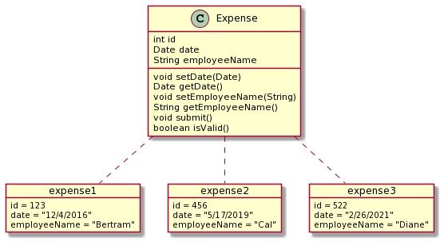

# Java Objects Basics

✨ See the Cheat Sheet at the bottom ✨

## Java Vocabulary

[**Class** - a blueprint for an object](https://docs.oracle.com/javase/tutorial/java/javaOO/classes.html)
- a class represents an abstract concept of something, like Expense or TimeSheetEntry
- each class exists in memory once

[**Object (Instance)** - a structure in memory that has its own data, and is tied to a class](https://docs.oracle.com/javase/tutorial/java/javaOO/objects.html)
- an instance represents an actual item, like "Ana's Expense on 1/3/2018"
- there can be many instances of a given class in memory
- you generate a new instance with the `new` keyword: `new Expense()`





[**Field** - a piece of data on an Object](https://docs.oracle.com/javase/tutorial/java/javaOO/variables.html)
- An Expense object might have an `employeeName` field, and a `date` field
- You can think of fields as properties, or attributes of the object
- Classes define what fields an instance can have. Instances store the actual field values.

[**Method** - a bit of code that can perform calculations, or change the fields of an object](https://docs.oracle.com/javase/tutorial/java/javaOO/methods.html)
- If a method just returns data, and doens't change the object, it's an "accessor" method (or a "getter" method)
- If a method alters the instances data, it's a "mutator" method (sometimes it's a "setter" method)

**Getter** - a method that typically just returns a specific field from an object
- For example `getEmployeeName()` or `getDate()`

**Setter** - a method that typically sets the value of a field on an object
- For example `setEmployeeName()` or `setDate()`

If you haven't downloaded IntelliJ, (try out the community edition)[https://www.jetbrains.com/idea/download/].

## Step 1

Run the following command, and enter your name:

```
./gradlew login
```

(this will allow your instructor to know which tests you've run and help set the pace of the class)

## Exercise - Hello World

1. Create a class named `MyApplication` in `src/main/java`
1. Add a `main` method to the class
1. In the `main` method, print something to `System.out` (for example `"Hello world"`)

### Run from IntelliJ

In the `MyApplication` test, click the green "play" button next to the `main` method.

Check your work:

Right-click on the file `src/test/java/MyApplicationTest` and click "run"

### Run from the Command Line

```
./gradlew assemble
java -cp build/classes/java/main MyApplication
```

Check your work:

```
./gradlew test --tests MyApplicationTest
```

----

## Exercise - Screenplay

1. create a class named `Screenplay` in `src/main/java`
1. add a private `String` field named `title` with a getter and setter
1. add a private field named `lines` that's an `ArrayList` of Strings
1. add a mutator method named `addLine` that takes a `String`, and adds it to the `lines` field
1. add an accessor method named `generate` that returns a `String` containing the title and all the lines, separated by a newline

As you write code, run the `ScreenplayTest` regularly.

You can run code in the `ScreenplayApplication` class. For example:

```java
Screenplay screenplay = new Screenplay();
screenplay.setTitle("Star Wars");
screenplay.addLine("may the force be with you");

System.out.println(screenplay.generate());
// should print
// Star Wars
// may the force be with you

screenplay.addLine("luke I am your father");
System.out.println(screenplay.generate());
// should print
// Star Wars
// may the force be with you
// luke I am your father
```

#### Running from the command line

Run the Screenplay application:

```
./gradlew assemble
java -cp build/classes/java/main ScreenplayApplication
```

Run tests:

```
./gradlew test --tests ScreenplayTest
```

Open test results from the command line (Mac / Linux):

```
open ./build/reports/tests/test/index.html
```

## Exercise - Form Fields

1. create a class named `FormFields`
1. add a private field `HashMap` named `fields` that maps `String` keys to `String` values
1. add a mutator method named `addField` that takes two `String`s (a key and a value), and adds an entry to the `HashMap`
1. add an accessor method named `urlEncoded` that returns a `String` containing all the fields and values like

The output of `urlEncoded` should look like this:
   
```
field1=value2&field2=value2
```

## Cheat Sheet

### Public Static Void Main

In IntelliJ, type `psvm` then hit the TAB key.

```java
public class SomeClass {

    public static void main(String[] args) {
    }

}
```

### Print things to the console

```java
System.out.println("this is my sentence");
```

### Basic State / Behavior Pattern

1. Define a private field
1. Define a mutator method (sometimes it's a setter)
1. Define an accessor method (sometimes it's a getter)

### [Declare an internal field](https://docs.oracle.com/javase/tutorial/java/javaOO/variables.html)

```java
class SomeClass {
    
    // declare a String field
    private String something;
    
    // declare a field that holds a list of Strings
    private ArrayList<String> someWords = new ArrayList<>();
    
    // declare a field that holds a list of Integers
    private ArrayList<Integer> someNumbers = new ArrayList<>();
    
    // declare a field that holds a map of Strings to Integers
    private HashMap<String, Integer> someMap = new HashMap<>();
    
}
```


### [Define a method](https://docs.oracle.com/javase/tutorial/java/javaOO/methods.html)

```java
class SomeClass {
    
    private int id;
    
    // define a mutator (setter)
    //  - return type is void   
    //  - there is no return statement   
    public void setId(int value) {
        this.value = value;
    }
    
    // define an accessor (getter)
    //  - return type is not void   
    //  - there is a return statement   
    public void setId(int value) {
        this.value = value;
    }
    
}
```

### Add to a List

```
ArrayList<Integer> numbers = new ArrayList<>();
numbers.add(1); // <-- call the ".add" method to add to the list
```


### [Loop over a list](https://docs.oracle.com/javase/tutorial/java/nutsandbolts/for.html)

This is called the "enhanced for loop."

```java
ArrayList<String> words = new ArrayList<>();
words.add("happy");
words.add("joyful");

// The code inside the loop will run twice 
// since there are two items in the ArrayList
for(String word : words) {
    System.out.println(word);
}
```


### Add to a HashMap

```
HashMap<Integer, Integer> numbers = new HashMap<>();
numbers.put(1, 5); // <-- call the ".put" method to add an entry to a HashMap
```


### [Loop over a HashMap](https://mkyong.com/java/how-to-loop-a-map-in-java/)

```java
HashMap<String, String> myMap = new HashMap<>();
myMap.put("name", "Tim");
myMap.put("zipCode", "10101");

// The code inside the loop will run twice 
// since there are two key/value pairs in the HashMap
for(Map.Entry<String, String> entry : myMap.entrySet()) {
    System.out.println(entry.getKey());
    System.out.println(entry.getValue());
}
```
