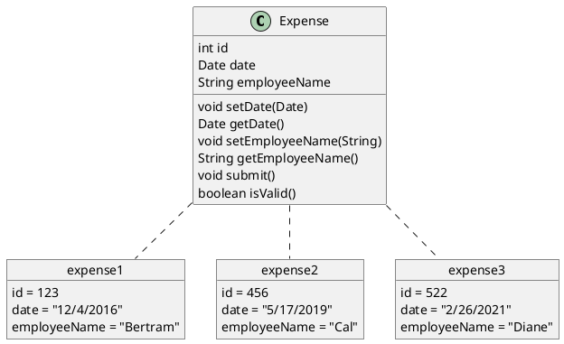

# Class with Instances

```plantuml
@startuml
class Expense {
  {field} int id
  {field} Date date
  {field} String employeeName
  {method} void setDate(Date)
  {method} Date getDate()
  {method} void setEmployeeName(String)
  {method} String getEmployeeName()
  {method} void submit()
  {method} boolean isValid()
}

object expense1
expense1 : id = 123
expense1 : date = "12/4/2016"
expense1 : employeeName = "Bertram"


object expense2
expense2 : id = 456
expense2 : date = "5/17/2019"
expense2 : employeeName = "Cal"

object expense3
expense3 : id = 522
expense3 : date = "2/26/2021"
expense3 : employeeName = "Diane"

Expense .. expense1
Expense .. expense2
Expense .. expense3
@enduml
```
